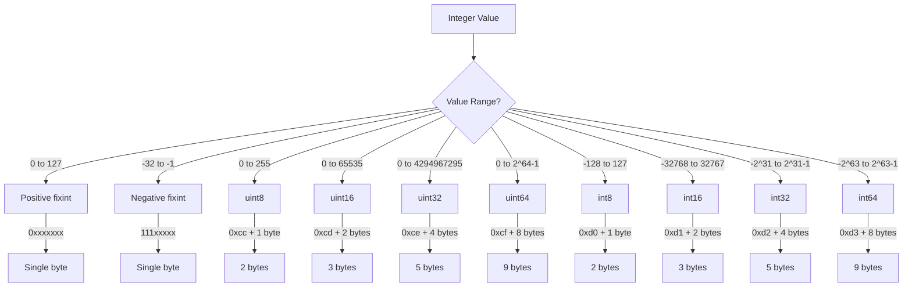

# Plan for Fixing MessagePack Test and Improving Documentation

## Problem Analysis

The test in `shapely-msgpack/src/tests.rs` is failing because there's a mismatch between the MessagePack binary format in the test data and how the decoder interprets it. Specifically:

1. The comment incorrectly identifies `0x1a` as a uint32 type prefix
2. In MessagePack, uint32 is represented by the prefix `0xce`, not `0x1a`
3. The value `0x1a` (decimal 26) is actually a positive fixint (since it's in the range 0x00-0x7f)

## Solution Plan

### 1. Fix the Test Data

We need to correct the test data to properly encode a uint32 value according to the MessagePack specification. There are two options:

**Option A**: Use the correct uint32 encoding:
```rust
let data = [
    0x82, // Fixmap with 2 elements
    0xa4, // Fixstr with length 4
    0x6e, 0x61, 0x6d, 0x65, // "name"
    0xa5, // Fixstr with length 5
    0x41, 0x6c, 0x69, 0x63, 0x65, // "Alice"
    0xa3, // Fixstr with length 3
    0x61, 0x67, 0x65, // "age"
    0xce, // uint32 (correct prefix for uint32)
    0x00, 0x00, 0x00, 0x1e, // 30
];
```

**Option B**: Use a more compact positive fixint encoding (since 30 is small enough):
```rust
let data = [
    0x82, // Fixmap with 2 elements
    0xa4, // Fixstr with length 4
    0x6e, 0x61, 0x6d, 0x65, // "name"
    0xa5, // Fixstr with length 5
    0x41, 0x6c, 0x69, 0x63, 0x65, // "Alice"
    0xa3, // Fixstr with length 3
    0x61, 0x67, 0x65, // "age"
    0x1e, // positive fixint with value 30
];
```

We recommend Option A for testing purposes, as it explicitly tests the uint32 decoding path, even though Option B is more efficient.

### 2. Improve Documentation

#### 2.1. Add References to MessagePack Specification

Add documentation comments to the constants.rs file that reference the MessagePack specification:

```rust
/// MessagePack type tags
/// As defined in the MessagePack specification: https://github.com/msgpack/msgpack/blob/master/spec.md
```

#### 2.2. Add Detailed Comments to Each Constant Group

For each group of constants, add a comment that explains their purpose and links to the relevant section of the spec:

```rust
/// Nil, Boolean, and Binary types
/// Ref: https://github.com/msgpack/msgpack/blob/master/spec.md#formats-nil
/// Ref: https://github.com/msgpack/msgpack/blob/master/spec.md#formats-bool
/// Ref: https://github.com/msgpack/msgpack/blob/master/spec.md#formats-bin
```

#### 2.3. Add Documentation to the Decoder Implementation

Add comments to the decoder methods that explain how they handle different MessagePack types:

```rust
/// Decodes a MessagePack-encoded unsigned 64-bit integer.
/// Handles the following MessagePack types:
/// - positive fixint (0x00 - 0x7f): single-byte positive integer
/// - uint8 (0xcc): 8-bit unsigned integer
/// - uint16 (0xcd): 16-bit unsigned integer (big-endian)
/// - uint32 (0xce): 32-bit unsigned integer (big-endian)
/// - uint64 (0xcf): 64-bit unsigned integer (big-endian)
/// Ref: https://github.com/msgpack/msgpack/blob/master/spec.md#int-format-family
```

### 3. Add a Test Case for Each Integer Format

To ensure robustness, add test cases for each integer format:

```rust
#[test]
fn test_integer_formats() {
    // Test positive fixint (0x00 - 0x7f)
    // Test uint8 (0xcc)
    // Test uint16 (0xcd)
    // Test uint32 (0xce)
    // Test uint64 (0xcf)
}
```

### 4. Create a Visual Format Reference

Add a markdown file (e.g., `FORMAT.md`) that provides a visual reference for MessagePack formats, including:

- Type byte ranges
- Format diagrams
- Examples of encoded values
- Links to the official specification

## Implementation Steps

1. Fix the test data in `shapely-msgpack/src/tests.rs`
2. Add documentation comments to `shapely-msgpack/src/constants.rs`
3. Add documentation comments to the decoder methods in `shapely-msgpack/src/lib.rs`
4. Create additional test cases for different integer formats
5. Create a `FORMAT.md` file with visual references

## MessagePack Integer Format Family



## Benefits of This Approach

1. **Correctness**: Ensures the test correctly validates the MessagePack implementation
2. **Documentation**: Improves code understanding by linking to the official specification
3. **Robustness**: Additional tests ensure all integer formats are handled correctly
4. **Educational**: Visual references help developers understand the binary format